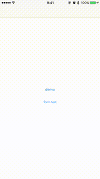

[](https://github.com/sgr-ksmt/DTFont/releases)
[](https://travis-ci.org/sgr-ksmt/DTFont)  
  
[](https://github.com/Carthage/Carthage)
[](https://cocoapods.org)

TODO: gif

# DTFont
DynamicTypeFont helper. Easy creation, custom font, auto update etc.



## Features
- **Custom** dynamic type font available.
- easy creation and powerful initializer (See Usage).
- Useful extension for `UILabel`, `UITextField`, `UITextView`, `UIButton`. update automatically dynamic type font when *UIContentSizeCategory* changed in Setting.app.

## Usage

### Create custom dynamic type font

```swift
import DTFont

// use UIFontTextStyle
_ = DTFont.make(with: "Avenir-Book", textStyle: .body)

// use DTSize (DTSize is a enum wrapped UIContentSizeCategory
_ = DTFont.make(with: "Avenir-Book") { size -> CGFloat in
    switch size {
    case .xs ... .l:
        return 18.0
    case .xl ... .xxxl:
        return 22.0
    default:
        return 24.0
    }
}

// use DTSize and comparision operator
_ = DTFont.make(with: "Avenir-Book") { size in size < .xl ? 18.0  : 22.0 }
_ = DTFont.make(with: "Avenir-Book") { $0 < .xl ? 18.0  : 22.0 }
```

### FontUpdater
If a user change UIContentSieCategory in Setting.app ([Accessibility] -> [Large Text]), dynamic type font must be updated manually.  
`DTFontUpdater` is a class that subscribe `UIContentSizeCategoryDidChange` notification.  

```swift
import DTFont

class ViewControlelr: UIViewController {

    @IBOutlet private weak var label: UILabel!

    private lazy var updater = DTFontUpdater()

    override func viewDidLoad() {
        super.viewDidLoad()
        updater.updateHandler = { [weak self] _ in
            self?.label.font = DTFont.make(with: "Avenir-Book", textStyle: .body)
        }
        // update immediately
        updater.update()
    }
}
```

### Update automatically
If you use dynamic type font in `UILabel`, `UITextField`, `UITextView`, `UIButton`,  
use `enableAutomaticFontUpdate:(updateImmediately:)` better than using `DTFontUpdater`.

```swift
class ViewControlelr: UIViewController {

    @IBOutlet private weak var label: UILabel! {
        didSet {
            label.enableAutomaticFontUpdate(with: DTFont.make(with: "Avenir-Book") { $0 < .l ? 18.0 : 22.0 })
            // if you don't want to update immediately
            label.enableAutomaticFontUpdate(with: DTFont.make(with: "Avenir-Book") { $0 < .l ? 18.0 : 22.0 }, updateImmediately: false)
        }
    }
}
```

## Requirements
- iOS 8.0 or later
- Xcode 8.0
- Swift 3.0

## Installation

### Carthage

- Add the following to your *Cartfile*:

```bash
github 'sgr-ksmt/DTFont'
```

- Then run command: `$ carthage update`
- Add the framework as described.
<br> Details: [Carthage Readme](https://github.com/Carthage/Carthage#adding-frameworks-to-an-application)


#### CocoaPods

**DTFont** is available through [CocoaPods](http://cocoapods.org). To install
it, simply add the following line to your Podfile:

```ruby
pod 'DTFont', '~> 2.0.1'
```

and run `pod install`


## Communication
- If you found a bug, please open an issue. :bow:
- Also, if you have a feature request, please open an issue. :thumbsup:
- If you want to contribute, submit a pull request.:muscle:

## License

**DTFont** is under MIT license. See the [LICENSE](LICENSE) file for more info.
